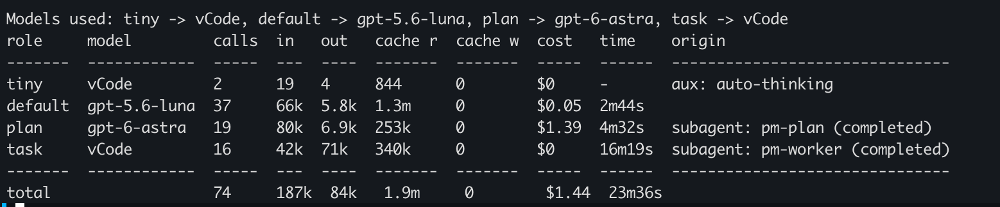

# omp-modellog

[](LICENSE)

An [omp](https://github.com/oh-my-pi) (`@oh-my-pi/pi-coding-agent`) extension
that answers one question: **which model roles did this session actually
use, in what order, and what did each cost?**

```
/modellog
Models used: tiny -> vCode, default -> gpt-5.6-luna, plan -> gpt-6-astra, task -> vCode

role     model         calls  in   out   cache r  cache w  cost   time    origin
-------  ------------  -----  ---  ----  -------  -------  -----  ------  -------------------------------
tiny     vCode         2      19   4     844      0        $0     -       aux: auto-thinking
default  gpt-5.6-luna  37     66k  5.8k  1.3m     0        $0.05  2m44s
plan     gpt-6-astra   19     80k  6.9k  253k     0        $1.39  4m32s   subagent: pm-plan (completed)
task     vCode         16     42k  71k   340k     0        $0     16m19s  subagent: pm-worker (completed)
-------  ------------  -----  ---  ----  -------  -------  -----  ------  -------------------------------
total                  74     187k  84k   1.9m     0        $1.44  23m36s
```

*(A real multi-agent session output. The `plan` row is real spend on an
expensive model — not a rounding artifact — recovered from the subagent's
own session file; see [below](#the-async-task--hub-handshake-the-one-non-obvious-part).)*



*(In that screenshot, `task -> unknown` is caught mid-flight: the `pm-worker`
subagent hadn't resolved its model via the async `hub` handshake yet at the
moment `/modellog` ran — see [below](#the-async-task--hub-handshake-the-one-non-obvious-part).
It resolves once the subagent settles.)*

It also writes the same summary to a log file when the session ends, so you
don't have to remember to ask.

## Install

Clone it, then symlink it into omp's global extensions directory
(auto-discovered, hot-reloadable with `/restart`):

```bash
git clone https://github.com/barelyworkingcode/omp-modellog.git
ln -s "$(pwd)/omp-modellog" ~/.omp/agent/extensions/omp-modellog
```

Verify it loaded:

```bash
omp -p "/modellog"
# Models used: (none yet)
```

Alternatives:

- **Per-invocation (for testing):** `omp -e /path/to/omp-modellog/src/index.ts`
- **Declarative:** add the absolute path to the `"extensions"` array in `~/.omp/agent/settings.json`
- **Project-only:** symlink or copy into `<project>/.omp/extensions/`
- **Disable without uninstalling:** add `omp-modellog` to `disabledExtensions` in `~/.omp/agent/config.yml`

No build step and no runtime dependencies — omp loads the TypeScript
directly. `bun install` is only needed for local typecheck/tests
(`@oh-my-pi/pi-coding-agent` is a `devDependency` used purely for
`import type`, which is erased at load time).

## Commands

- `/modellog` — a table: role, model, call count, token breakdown, cost, time spent, origin.
- `/modellog roles` — just the headline.
- `/modellog json` — machine-readable, same data.

A live one-line summary also shows in the status bar as the session runs.

## How it decides "role"

omp already records which role produced each turn — this extension mostly
*replays* that, it doesn't infer much:

- Every model switch is a `model_change` session entry carrying `role` (e.g.
  `"plan"`, `"smol"`). Per omp's own source comment, an **undefined** role
  means the default model, so that's labeled `default`.
- `"fallback"` is a real sentinel (a retry silently swapped in a fallback
  model) and is shown as its own role, not folded into anything else.
- `"temporary"` means an explicit `/model` pick made outside the role system
  (not persisted to a role). This extension tries to match that model back
  to whichever configured role currently points at it (`ctx.models.resolve("@<role>")`
  for each of the nine built-in roles); if none match, it's labeled `custom`.
  Such rows are marked with a trailing `*` and footnoted, since the label is
  inferred rather than structurally recorded.
- Background/auxiliary model calls (`model_usage` entries, e.g. auto-thinking)
  show up as their own `aux`-origin rows, labeled by role or purpose.
- `task`-tool sub-agent runs are labeled by the role/agent the task tool
  itself declared (`modelRole` on the tool result), not the parent turn's role.

Rows are inserted into an order-preserving map the first time a
(role, model) pair appears, and **never re-sorted** — that's what makes the
headline reflect true call order.

## The async `task` → `hub` handshake (the one non-obvious part)

This build's `task` tool spawns asynchronously by default. The `task` tool
result recorded at call time is a placeholder — `results: []` and a
`progress: [{ status: "pending", ... }]` entry with **no resolved model and
all-zero counters**. The actual outcome (resolved model, duration, final
status) arrives later through a *separate* `hub` tool result (`hub jobs` /
`hub wait`), keyed by the same job id.

This was discovered empirically against a live session, not from the
extension docs — a naive implementation that only reads `task` results
would show `unknown` forever for any subagent launched this way. This
extension tracks subagent rows by job id across both tool results and
reconciles the `hub` completion into the row the `task` placeholder created,
including a de-dupe guard so re-polling an already-settled job doesn't
double-count its duration.

A completed `hub` job, however, carries duration/model/status and **nothing
else** — no tokens, no cost, ever, for any subagent observed so far. Relying
on that alone made every multi-agent (`pm-plan`/`pm-worker`-style) session
show real duration but an unhelpful `-` for a subagent role's cost — which
is exactly wrong when that role is the expensive one (a `plan`-role subagent
on a frontier model can outspend the main session).

The fix: a subagent always runs as its own nested omp session, written to
`<parent session directory>/<jobId>.jsonl`, with full per-turn usage/cost
just like any other session — the parent-side tool results just never
surface it. This extension reads that file directly and sums its real
usage once a job settles, overriding both the `hub` completion (which has
none) and a `task` result's own `usage` (when present, it's usually a
subset — the child file is the ground truth). It falls back to whatever
flat numbers the job itself reported only if that file can't be found or
read (e.g. a subagent stored somewhere non-standard). Job ids are validated
as plain filename segments before being used in a path — they ultimately
trace back to a task name an LLM chose, so they're treated as untrusted
input, not a path an extension can construct freely.

## Why not `~/.omp/stats.db`

There's an internal sqlite analytics store at `~/.omp/stats.db` with
per-message tokens/cost/duration. It was deliberately **not** used:

- It has no `role` column — it can't answer the actual question.
- Everything useful in it (duration, usage, cost) is already on the session
  entries this extension reads directly.
- It's populated by a background sync worker, so it lags the live session —
  exactly wrong for an end-of-session report.
- It's undocumented and not part of the extension API surface, so its shape
  could change under this extension without notice.

## End-of-session log

On `session_shutdown` (and on `session_before_switch` for `/new`, `/resume`,
`/fork`), a summary is appended to:

- `~/.omp/agent/modellog/sessions.jsonl` — one JSON record per session
- `~/.omp/agent/modellog/sessions.log` — one human-readable line per session

The TUI is not paintable by the time `session_shutdown` fires (omp explicitly
avoids a final render during teardown), so this is a **file write**, not a
UI notification. It's synchronous on purpose — `session_shutdown` handlers
get a hard ~2s budget, and a sync `fs.appendFileSync` can't be cut short by
that timeout the way an `await` could.

Overrides:

- `OMP_MODELLOG_DIR=/path` — write the log elsewhere.
- `OMP_MODELLOG_QUIET=1` — disable the end-of-session write entirely (the
  `/modellog` command still works).

A sub-agent (task tool) run reloads this same extension inside itself; a
`session_init` entry is the one reliable signal that a session is a
sub-agent, and every command/hook here checks it first so nothing is
double-registered or double-logged inside a sub-agent.

## Development

```bash
bun install   # devDependency only, for typecheck/tests
bun test      # collect/roles/format are pure and fully unit tested
tsc --noEmit -p tsconfig.json
```

`src/collect.ts`, `src/roles.ts`, and `src/format.ts` have no omp import at
all — they take plain data in and plain data out, which is what makes them
testable without a running TUI. `src/index.ts` is the only file that touches
the real `ExtensionAPI`.

Manual smoke test against the real binary:

```bash
mkdir -p /tmp/modellog-scratch && cd /tmp/modellog-scratch
omp -p "hi" -e /path/to/omp-modellog/src/index.ts --mode text   # loads without error
omp -p "/modellog" -c -e /path/to/omp-modellog/src/index.ts --mode text   # replays the session
```

## License

[MIT](LICENSE)
